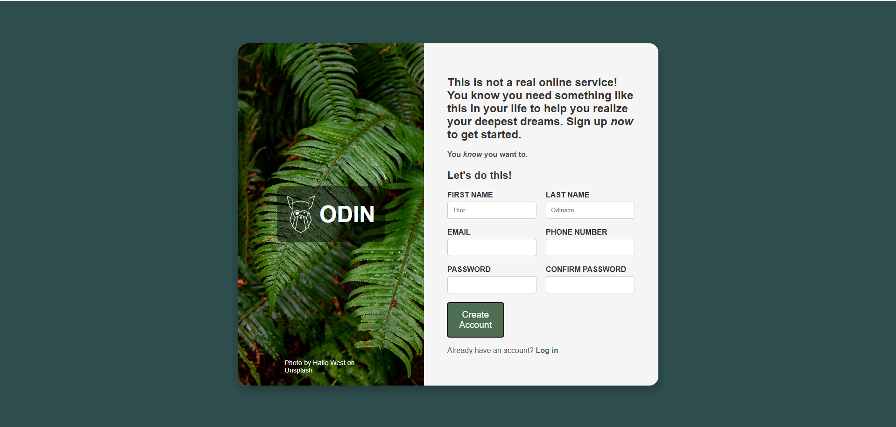

# Signup Form Project

This project is a responsive signup form built using HTML and CSS. It features a visually appealing design with an image section, form section, and a logo overlay. The layout is fully responsive and adapts well to different screen sizes.

## Features

- **Modern UI Design**: Clean and minimalistic design with a rounded container and shadow effect.
- **Responsive Layout**: The form is optimized for desktop and mobile views.
- **Form Validation**: Basic validation for password fields.
- **Custom Styling**: Styled with CSS including hover effects and focus states.

## Technologies Used

- **HTML5** for the structure
- **CSS3** for styling and layout

## Project Structure

```
project-folder/
├── assets/
│   ├── fern.jpg
│   ├── odin-lined.png
├── index.html
├── styles.css
└── README.md
```

## Setup Instructions

1. Clone the repository:
   ```bash
   git clone https://github.com/your-username/signup-form.git
   ```

2. Navigate to the project directory:
   ```bash
   cd signup-form
   ```

3. Open `index.html` in your browser to view the signup form.

## Usage

- Fill in the signup form with your details.
- Ensure passwords match before submitting.
- Click on "Create Account" to proceed.

## Screenshots



## Future Enhancements

- Add JavaScript validation for better user experience.
- Integrate with a backend API for storing user data.
- Improve accessibility features.

## License

This project is licensed under the MIT License.

## Credits

- Background image by Halie West on Unsplash.
- Odin logo inspired by The Odin Project.

---

Feel free to contribute or report any issues by opening an issue in the repository.

# Signup Form Project

This project is a responsive signup form built using HTML and CSS. It features a visually appealing design with an image section, form section, and a logo overlay. The layout is fully responsive and adapts well to different screen sizes.

## Features

- **Modern UI Design**: Clean and minimalistic design with a rounded container and shadow effect.
- **Responsive Layout**: The form is optimized for desktop and mobile views.
- **Form Validation**: Basic validation for password fields.
- **Custom Styling**: Styled with CSS including hover effects and focus states.

## Technologies Used

- **HTML5** for the structure
- **CSS3** for styling and layout

## Project Structure

```
project-folder/
├── assets/
│   ├── fern.jpg
│   ├── odin-lined.png
├── index.html
├── styles.css
└── README.md
```

## Setup Instructions

1. Clone the repository:
   ```bash
   git clone https://github.com/your-username/signup-form.git
   ```

2. Navigate to the project directory:
   ```bash
   cd signup-form
   ```

3. Open `index.html` in your browser to view the signup form.

## Usage

- Fill in the signup form with your details.
- Ensure passwords match before submitting.
- Click on "Create Account" to proceed.

## Screenshots


## Future Enhancements

- Add JavaScript validation for better user experience.
- Integrate with a backend API for storing user data.
- Improve accessibility features.

## License

This project is licensed under the MIT License.

## Credits

- Background image by Halie West on Unsplash.
- Odin logo inspired by The Odin Project.

---

Feel free to contribute or report any issues by opening an issue in the repository.

